# Sistem Mimarisi 🏗️

> **E-Commerce Dashboard Teknik Mimari ve Tasarım Dokümantasyonu**

## 🎯 Genel Mimari Bakış

E-Commerce Dashboard, modern mikroservis mimarisine yakın bir yaklaşımla tasarlanmış, frontend ve backend olarak ayrılmış (decoupled) bir uygulamadır.

```mermaid
graph TB
    U[👤 Kullanıcı] --> F[📱 Frontend React App]
    F --> API[🔌 REST API Gateway]
    API --> AUTH[🔐 JWT Auth Middleware]
    AUTH --> GA[📊 Google Analytics Service]
    AUTH --> REPORT[📄 Report Generator]
    AUTH --> DB[(🗄️ PostgreSQL)]
    GA --> GOOGLE[☁️ Google Analytics API]
    REPORT --> FS[📁 File System]
    API --> CACHE[(⚡ Redis Cache)]
```



---

## 🏛️ Katmanlı Mimari

### 1. Presentation Layer (Sunum Katmanı)
**Teknoloji:** React 19 + TypeScript + Vite

```
frontend/src/
├── components/          # Yeniden kullanılabilir bileşenler
│   ├── ui/             # Temel UI bileşenleri (Button, Input, etc.)
│   ├── charts/         # Chart.js wrapper bileşenleri
│   └── layout/         # Layout bileşenleri (Header, Sidebar)
├── pages/              # Sayfa bileşenleri
│   ├── Dashboard.tsx   # Ana dashboard
│   ├── GoogleAnalytics.tsx  # GA raporları
│   └── Login.tsx       # Giriş sayfası
├── services/           # API çağrı servisleri
│   └── api.ts         # Axios yapılandırması
├── hooks/              # Custom React hooks
├── types/              # TypeScript tip tanımları
└── utils/              # Yardımcı fonksiyonlar
```

**Özellikler:**
- ✅ Server-Side Rendering (SSR) desteği yok (SPA)
- ✅ TypeScript ile tip güvenliği
- ✅ TanStack Query ile state yönetimi
- ✅ Responsive design (Mobile-first)
- ✅ Chart.js entegrasyonu

### 2. API Gateway Layer (API Katmanı)
**Teknoloji:** Express.js + TypeScript

```
backend/src/
├── routes/             # API endpoint'leri
│   ├── analytics.ts   # Google Analytics routes
│   ├── auth.ts        # Authentication routes
│   └── health.ts      # Health check
├── middleware/         # Express middleware'leri
│   ├── auth.ts        # JWT doğrulama
│   ├── cors.ts        # CORS yapılandırması
│   └── helmet.ts      # Güvenlik headers
├── services/          # Business logic
│   ├── googleAnalytics.ts
│   ├── reportGenerator.ts
│   └── userService.ts
├── config/            # Yapılandırma dosyaları
│   ├── database.ts
│   └── redis.ts
└── types/             # TypeScript interfaces
```

### 3. Business Logic Layer (İş Mantığı Katmanı)

#### Google Analytics Service
```typescript
class GoogleAnalyticsService {
  private analyticsDataClient: BetaAnalyticsDataClient | null = null;
  
  // Lazy initialization pattern
  private initClient() { ... }
  
  // Factory method pattern
  async getReport(propertyId, startDate, endDate, metrics, dimensions) {
    // Template method pattern
    this.validateRequest();
    const response = await this.fetchData();
    return this.formatResponse(response);
  }
}
```

**Kullanılan Tasarım Desenleri:**
- **Singleton Pattern:** Service sınıfları
- **Factory Pattern:** Report generators
- **Template Method:** Rapor oluşturma
- **Strategy Pattern:** Farklı rapor formatları

### 4. Data Access Layer (Veri Erişim Katmanı)

#### Database Schema (PostgreSQL + Prisma)
```prisma
model User {
  id        Int      @id @default(autoincrement())
  email     String   @unique
  password  String
  role      String   @default("user")
  createdAt DateTime @default(now())
  reports   Report[]
}

model Report {
  id          Int      @id @default(autoincrement())
  name        String
  type        String
  filePath    String
  userId      Int
  user        User     @relation(fields: [userId], references: [id])
  createdAt   DateTime @default(now())
  metrics     Json?
  dimensions  Json?
}
```

#### Caching Strategy (Redis)
```typescript
class CacheService {
  // Time-based expiration
  async set(key: string, value: any, ttl = 3600) { ... }
  
  // Cache-aside pattern
  async get(key: string) { ... }
  
  // Write-through pattern for reports
  async cacheReport(reportId: string, data: any) { ... }
}
```

---

## 🔄 Data Flow (Veri Akışı)

### 1. Tipik Request Flow


### 2. Error Handling Flow
```typescript
// Global error handling middleware
app.use((err: Error, req: Request, res: Response, next: NextFunction) => {
  logger.error(err.stack);
  
  // Operational vs Programming errors
  if (err instanceof GoogleAnalyticsError) {
    return res.status(503).json({
      success: false,
      message: 'Analytics service unavailable',
      retryAfter: 60
    });
  }
  
  // Fallback for unknown errors
  res.status(500).json({
    success: false,
    message: 'Internal server error'
  });
});
```

---

## 🔐 Güvenlik Mimarisi

### 1. Authentication & Authorization

```mermaid
graph LR
    LOGIN[🔑 Login] --> JWT[🎫 JWT Token]
    JWT --> VERIFY[✅ Verify Token]
    VERIFY --> ROLES[👥 Role Check]
    ROLES --> ACCESS[🚪 Grant Access]
```



**JWT Token Structure:**
```json
{
  "header": {
    "alg": "HS256",
    "typ": "JWT"
  },
  "payload": {
    "userId": 1,
    "email": "admin@example.com",
    "role": "admin",
    "iat": 1640995200,
    "exp": 1641081600
  }
}
```

### 2. API Security Layers

1. **CORS Policy**
   ```typescript
   app.use(cors({
     origin: process.env.FRONTEND_URL || 'http://localhost:3001',
     credentials: true,
     optionsSuccessStatus: 200
   }));
   ```

2. **Helmet Security Headers**
   ```typescript
   app.use(helmet({
     contentSecurityPolicy: {
       directives: {
         defaultSrc: ["'self'"],
         styleSrc: ["'self'", "'unsafe-inline'"],
         scriptSrc: ["'self'"],
         imgSrc: ["'self'", "data:", "https:"]
       }
     }
   }));
   ```

3. **Rate Limiting**
   ```typescript
   const limiter = rateLimit({
     windowMs: 15 * 60 * 1000, // 15 minutes
     max: 100, // limit each IP to 100 requests per windowMs
     message: 'Too many requests from this IP'
   });
   ```

### 3. Data Validation & Sanitization
```typescript
// Input validation using Joi
const reportRequestSchema = Joi.object({
  startDate: Joi.date().iso().required(),
  endDate: Joi.date().iso().min(Joi.ref('startDate')).required(),
  metrics: Joi.array().items(Joi.string()).min(1).max(10),
  dimensions: Joi.array().items(Joi.string()).max(10)
});

// XSS protection
const sanitize = (input: string) => {
  return DOMPurify.sanitize(input);
};
```

---

## 📊 Performance Architecture

### 1. Caching Strategy

```mermaid
graph TD
    REQ[📥 Request] --> CACHE{⚡ Redis Cache}
    CACHE -->|Hit| RETURN[📤 Cached Data]
    CACHE -->|Miss| GA[📊 Google Analytics API]
    GA --> STORE[💾 Store in Cache]
    STORE --> RETURN
```



**Cache Layers:**
- **L1 (Memory):** In-memory caching for frequently accessed data
- **L2 (Redis):** Distributed cache for API responses
- **L3 (Database):** Persistent storage for reports

### 2. Database Optimization

```sql
-- Indexing strategy
CREATE INDEX idx_reports_user_created ON reports(user_id, created_at DESC);
CREATE INDEX idx_users_email ON users(email);

-- Partitioning for large reports table
CREATE TABLE reports_2025 PARTITION OF reports 
FOR VALUES FROM ('2025-01-01') TO ('2026-01-01');
```

### 3. File System Architecture

```
uploads/
├── reports/                 # Generated reports
│   ├── 2025/               # Year-based partitioning
│   │   ├── 01/            # Month-based partitioning
│   │   └── 02/
├── temp/                   # Temporary files
└── assets/                 # Static assets
```

---

## 🔌 Integration Architecture

### 1. Google Analytics Integration

```typescript
// Service Account Authentication
class GoogleAnalyticsService {
  private getCredentials(): GoogleAuth {
    const credentials = JSON.parse(
      Buffer.from(process.env.GOOGLE_CREDENTIALS_BASE64!, 'base64').toString()
    );
    
    return new GoogleAuth({
      credentials,
      scopes: ['https://www.googleapis.com/auth/analytics.readonly']
    });
  }
}
```

### 2. External API Patterns

```typescript
// Circuit Breaker Pattern for external APIs
class CircuitBreaker {
  private failures = 0;
  private nextAttempt = Date.now();
  private state: 'CLOSED' | 'OPEN' | 'HALF_OPEN' = 'CLOSED';

  async call<T>(fn: () => Promise<T>): Promise<T> {
    if (this.state === 'OPEN') {
      if (this.nextAttempt <= Date.now()) {
        this.state = 'HALF_OPEN';
      } else {
        throw new Error('Circuit breaker is OPEN');
      }
    }

    try {
      const result = await fn();
      this.onSuccess();
      return result;
    } catch (error) {
      this.onFailure();
      throw error;
    }
  }
}
```

---

## 📈 Scalability Architecture

### 1. Horizontal Scaling

```yaml
# Docker Compose for scaling
version: '3.8'
services:
  app:
    image: ecommerce-dashboard:latest
    deploy:
      replicas: 3
    ports:
      - "3000-3002:3000"
    
  nginx:
    image: nginx:alpine
    ports:
      - "80:80"
    depends_on:
      - app
```

### 2. Database Scaling

```mermaid
graph TB
    APP[🖥️ Application] --> MASTER[(👑 Master DB)]
    APP --> REPLICA1[(📖 Read Replica 1)]
    APP --> REPLICA2[(📖 Read Replica 2)]
    MASTER --> REPLICA1
    MASTER --> REPLICA2
```



**Read/Write Splitting:**
```typescript
class DatabaseService {
  private masterConnection: Pool;
  private replicaConnections: Pool[];

  async query(sql: string, params: any[]) {
    if (sql.trim().toUpperCase().startsWith('SELECT')) {
      // Use read replica
      const replica = this.getRandomReplica();
      return replica.query(sql, params);
    } else {
      // Use master for writes
      return this.masterConnection.query(sql, params);
    }
  }
}
```

### 3. Monitoring & Observability

```typescript
// Metrics collection
class MetricsCollector {
  private static instance: MetricsCollector;
  
  trackAPICall(endpoint: string, duration: number, status: number) {
    // Prometheus metrics
    this.httpRequestDuration.observe(
      { endpoint, status: status.toString() },
      duration / 1000
    );
  }
  
  trackGoogleAnalyticsCall(duration: number, success: boolean) {
    this.externalAPICallDuration.observe(
      { service: 'google-analytics', success: success.toString() },
      duration / 1000
    );
  }
}
```

---

## 🧪 Testing Architecture

### 1. Test Pyramid

```
    🔺 E2E Tests
   🔺🔺 Integration Tests  
  🔺🔺🔺 Unit Tests
```

**Test Structure:**
```
tests/
├── unit/                   # Jest unit tests
│   ├── services/
│   └── utils/
├── integration/            # API integration tests
│   ├── analytics.test.ts
│   └── auth.test.ts
└── e2e/                   # Cypress/Playwright tests
    ├── dashboard.spec.ts
    └── reports.spec.ts
```

### 2. Test Patterns

```typescript
// Test Factory Pattern
class TestDataFactory {
  static createUser(overrides = {}) {
    return {
      email: 'test@example.com',
      password: 'hashedPassword',
      role: 'user',
      ...overrides
    };
  }
  
  static createGAResponse(overrides = {}) {
    return {
      rows: [
        { dimensionValues: [{ value: 'Turkey' }], metricValues: [{ value: '1000' }] }
      ],
      ...overrides
    };
  }
}
```

---

## 📋 Deployment Architecture

### 1. CI/CD Pipeline

```yaml
# GitHub Actions
name: Deploy
on:
  push:
    branches: [main]

jobs:
  test:
    runs-on: ubuntu-latest
    steps:
      - uses: actions/checkout@v3
      - run: npm test
      
  build:
    needs: test
    runs-on: ubuntu-latest
    steps:
      - uses: actions/checkout@v3
      - run: docker build -t app:${{ github.sha }} .
      
  deploy:
    needs: build
    runs-on: ubuntu-latest
    steps:
      - run: kubectl set image deployment/app app=app:${{ github.sha }}
```

### 2. Environment Configurations

```typescript
// Environment-specific configs
const config = {
  development: {
    database: { host: 'localhost', port: 5432 },
    redis: { host: 'localhost', port: 6379 },
    logging: { level: 'debug' }
  },
  staging: {
    database: { host: 'staging-db', port: 5432 },
    redis: { host: 'staging-redis', port: 6379 },
    logging: { level: 'info' }
  },
  production: {
    database: { host: 'prod-db', port: 5432 },
    redis: { host: 'prod-redis', port: 6379 },
    logging: { level: 'error' }
  }
};
```

---

## 🔍 Monitoring & Logging

### 1. Application Monitoring

```typescript
// Winston Logger Configuration
const logger = winston.createLogger({
  level: 'info',
  format: winston.format.combine(
    winston.format.timestamp(),
    winston.format.errors({ stack: true }),
    winston.format.json()
  ),
  transports: [
    new winston.transports.File({ filename: 'error.log', level: 'error' }),
    new winston.transports.File({ filename: 'combined.log' }),
    new winston.transports.Console({
      format: winston.format.simple()
    })
  ]
});
```

### 2. Health Checks

```typescript
// Health check endpoint
app.get('/health', (req: Request, res: Response) => {
  const health = {
    status: 'OK',
    timestamp: new Date().toISOString(),
    uptime: process.uptime(),
    environment: process.env.NODE_ENV,
    memory: process.memoryUsage(),
    database: {
      status: 'connected',
      host: process.env.DATABASE_URL
    },
    redis: {
      status: redisClient.status,
      host: process.env.REDIS_URL
    },
    googleAnalytics: {
      status: 'connected',
      propertyId: process.env.GOOGLE_ANALYTICS_PROPERTY_ID
    }
  };
  
  res.json(health);
});
```

---

## 📚 Design Patterns Summary

| Pattern | Usage | Location |
|---------|--------|----------|
| **Singleton** | Service instances | `services/` |
| **Factory** | Report generators | `services/reportGenerator.ts` |
| **Repository** | Data access abstraction | `repositories/` |
| **Middleware** | Request processing | `middleware/` |
| **Strategy** | Report formats | `services/formatters/` |
| **Observer** | Event handling | `events/` |
| **Circuit Breaker** | External API calls | `services/circuitBreaker.ts` |
| **Template Method** | Report generation | `services/reportGenerator.ts` |

---

**🏗️ Bu mimari dokümantasyonu, Elle Shoes E-Commerce Dashboard'un teknik altyapısının detaylı açıklamasıdır. Sistem tasarımı hakkında sorularınız için development ekibi ile iletişime geçin.**